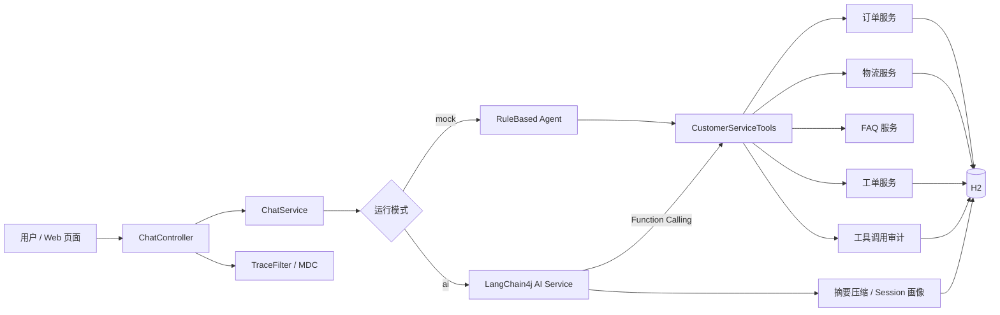

# AI Customer Service Agent

基于 **Java 17 + Spring Boot + LangChain4j Function Calling** 的电商智能客服与工单自动化系统。

项目不是“让大模型直接编造订单信息”，而是让模型理解用户意图并选择 Java 业务工具，由后端完成订单、物流、FAQ 和工单查询，再把真实结果交给模型组织回答。

## 项目亮点

- **真实 Tool Calling**：通过 LangChain4j AI Services 和 `@Tool` 封装 6 个业务工具。
- **双运行模式**：默认 `mock` 模式无需 API Key；`ai` 模式连接阿里云百炼通义千问。
- **业务闭环**：覆盖订单查询、物流跟踪、售后政策、创建工单、工单查询和转人工。
- **全链路可观测性**：请求返回 TraceId，控制台输出 JSON 日志，工具审计记录 TraceId、耗时和成功状态。
- **分层会话记忆**：AI 模式对长对话进行异步摘要压缩，按 `customerId + sessionId` 隔离并持久化到 H2。
- **P1 请求保护**：支持客户 API Key 可选鉴权、客户级单机限流、输入清洗与提示词注入拦截。
- **可靠性设计**：缺少订单号时追问，禁止无依据回答，工具失败时降级转人工。
- **工程质量**：统一错误码、参数校验、H2 文件数据库、Swagger、52 项自动测试和 GitHub Actions。

## 架构



详细设计见 [docs/architecture.md](docs/architecture.md)。

## 技术栈

| 分类 | 技术 |
|---|---|
| 后端 | Java 17、Spring Boot 3.5.16、Bean Validation |
| AI | LangChain4j 1.18.1、AI Services、Function Calling |
| 数据 | MyBatis-Plus 3.5.17、H2 2.x |
| 接口 | RESTful API、Springdoc OpenAPI |
| 测试 | JUnit 5、Mockito、MockMvc、Spring Boot Test |
| 工程 | Maven Wrapper、GitHub Actions |
| 可观测性 | SLF4J MDC、Logback JSON、TraceId、工具审计 |

## 快速启动

### 1. 环境要求

- JDK 17 或更高版本
- 不需要预装 Maven

### 2. 默认 mock 模式

Windows：

```powershell
.\mvnw.cmd spring-boot:run
```

macOS / Linux：

```bash
chmod +x mvnw
./mvnw spring-boot:run
```

访问：

- 聊天页面：http://localhost:8080
- Swagger：http://localhost:8080/swagger-ui.html
- 健康检查：http://localhost:8080/actuator/health

### 3. 通义千问 AI 模式

不要把 API Key 写入配置文件或提交到 GitHub。

PowerShell：

```powershell
$env:DASHSCOPE_API_KEY="你的百炼 API Key"
$env:SPRING_PROFILES_ACTIVE="ai"
.\mvnw.cmd spring-boot:run
```

可通过 `AI_MODEL_NAME` 修改模型，默认使用 `qwen-plus`。

### 4. 可选开启客户 API Key 鉴权

鉴权默认关闭，且只在 `ai` 模式开启后强制执行。不要把客户密钥写进仓库，可在 PowerShell 中用环境 JSON 注入：

```powershell
$env:SPRING_APPLICATION_JSON='{"app":{"auth":{"enabled":true,"customer-api-keys":{"customer-demo":"replace-with-a-strong-key"}}}}'
```

请求时同时传递 `X-Customer-Id: customer-demo` 和 `X-Api-Key`。本机 mock 演示不需要配置这两项。

## 演示问题

项目自带模拟订单：`ORD1001`、`ORD1002`、`ORD1003`、`ORD1004`。

```text
查询 ORD1001 的物流
退款政策是什么？
为 ORD1002 创建售后工单，商品损坏
查询订单 ORD1004
我要转人工客服
```

## API 示例

```bash
curl -X POST http://localhost:8080/api/v1/chat \
  -H "Content-Type: application/json" \
  -H "X-Customer-Id: customer-demo" \
  -d '{"sessionId":"demo-001","customerId":"customer-demo","message":"查询 ORD1001 的物流"}'
```

响应：

```json
{
  "sessionId": "demo-001",
  "answer": "物流公司=顺丰速运，运单号=SF202608120001，最新状态=运输中，已到达深圳转运中心",
  "toolCalls": ["getLogistics"],
  "transferredToHuman": false,
  "mode": "mock",
  "traceId": "20260819135612A3F9C812D401"
}
```

响应头也会返回 `X-Trace-Id`。可以用该值关联 API 响应、JSON 控制台日志和
`tool_call_log` 审计记录。业务日志事件包括 `agentRequest`、`llmCall`、`toolCall`、
`agentFallback` 和 `agentResponse`。

完整请求集合见 [postman/AI-Customer-Service-Agent.postman_collection.json](postman/AI-Customer-Service-Agent.postman_collection.json)。

## 业务工具

| 工具 | 职责 |
|---|---|
| `getOrderDetail` | 根据订单号查询订单 |
| `getLogistics` | 查询物流公司、运单和状态 |
| `searchFaq` | 查询退款、退货、发货等政策 |
| `createTicket` | 校验订单并创建售后工单 |
| `getTicketStatus` | 查询工单状态 |
| `transferToHuman` | 资料不足、工具失败或用户要求时转人工 |

## 测试

```bash
./mvnw test
```

当前包含 **52 项自动测试**，并附带 30 条固定客服评测样例，覆盖：

- 正常、边界和异常接口
- 订单号缺失与不存在
- 物流不存在
- FAQ 路由
- 重复工单拦截
- 人工转接
- 无关请求及提示词/密钥探测
- TraceId 并发唯一性与 HTTP 回传
- 会话摘要压缩与 H2 持久化恢复
- `customerId + sessionId` 记忆隔离与异步摘要
- AI 模式鉴权、429 限流和稳定错误码

## 项目结构

```text
src/main/java/com/chenxuekun/aicustomer
├── agent       # AI/规则 Agent、调用上下文
├── config      # 通义千问与 LangChain4j 配置
├── controller  # REST 接口
├── dto         # 请求响应对象
├── entity      # 数据实体
├── exception   # 业务异常和统一处理
├── mapper      # MyBatis-Plus Mapper
├── memory      # AI 会话摘要压缩与记忆提供器
├── observability # TraceId、MDC 与结构化事件日志
└── service     # 订单、物流、FAQ、工单及聊天编排
```

## 安全说明

- 仓库不保存真实客户数据，所有订单均为模拟数据。
- API Key 只从环境变量读取。
- `.env`、本地数据库、日志和构建目录均被 `.gitignore` 排除。
- 工具日志会截断并清理换行，避免把超长输入原样写入数据库。
- 对话数据以 `customerId + sessionId` 为边界；演示用 API Key 鉴权不等同于完整的 OAuth2/JWT 登录体系。
- 该项目用于学习和求职展示，不应未经安全加固直接用于生产环境。

## 设计取舍

项目有意不引入 RAG、Redis、RabbitMQ、Docker、微服务和多 Agent。P1 仍定位为“单机生产化演示版”：完成身份边界、请求保护与异步记忆，但不声称已支持多实例。真正多实例部署时，应将 H2、本地会话缓存和限流计数迁移至 PostgreSQL/Redis，并接入正式身份系统。

## 开源致谢

项目参考了 [LangChain4j 官方 Customer Support Agent 示例](https://github.com/langchain4j/langchain4j-examples/tree/main/customer-support-agent-example) 的 AI Services 与工具调用思路，业务模型、数据层、异常处理、审计、测试和页面均独立实现。

## License

本项目采用 [Apache License 2.0](LICENSE)。
